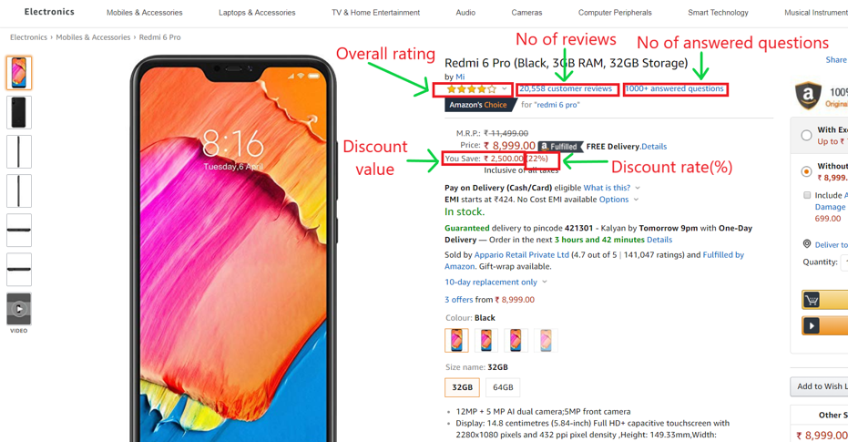
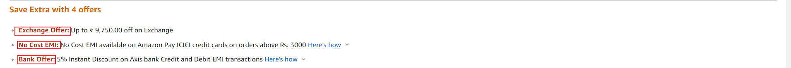

# Analysis-and-understanding-parameters-influencing-online-product-sales

***Abstract***

This project presents a research which can assist online sellers to improve their sales of product.
Understanding the factors that influence sales is important for online sellers to manage their supply chains. 
Using data from Amazon we attempt to predict if online review variables such as valence and volume of reviews, the number of positive and negative reviews, and online promotional marketing variables such as discounts and free deliveries, can influence the demand of electronic products in Amazon. The goal of this study is to examine the comparative influence of promotional marketing strategies such as discounts and the provision of free delivery options, and online reviews information such as the ratings of the products and the percentage of positive and negative reviews on products. The demand of products in this study is measured by a product’s online sales rank. The findings of this study can be helpful for online sellers to manage their businesses. 

***Parameters***

