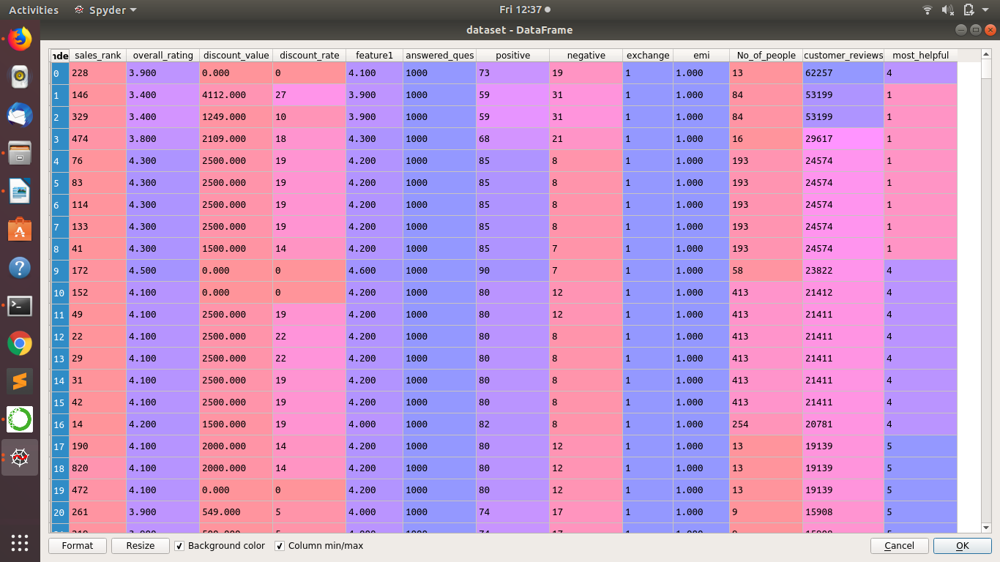
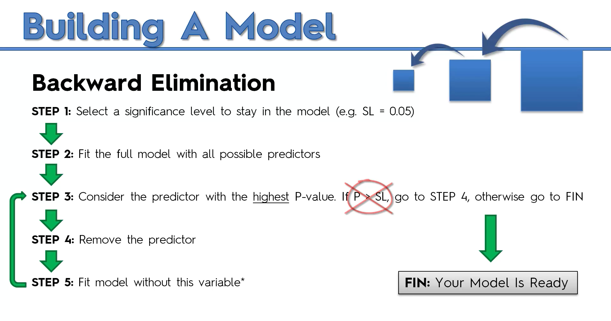

# Analysis-and-understanding-parameters-influencing-online-product-sales

***Abstract***

This project presents a research which can assist online sellers to improve their sales of product.
Understanding the factors that influence sales is important for online sellers to manage their supply chains. 
Using data from Amazon we attempt to predict if online review variables such as valence and volume of reviews, the number of positive and negative reviews, and online promotional marketing variables such as discounts and free deliveries, can influence the demand of electronic products in Amazon. The goal of this study is to examine the comparative influence of promotional marketing strategies such as discounts and the provision of free delivery options, and online reviews information such as the ratings of the products and the percentage of positive and negative reviews on products. The demand of products in this study is measured by a product’s online sales rank. The findings of this study can be helpful for online sellers to manage their businesses. 

***Parameters***

These are the required parameters which we are going to calculate the importance of

**PHASE 1**

***Data Extraction***
Firstly, collection of dataset by scraping the required parameters from the website.
The data which is scraped is stored in a file in .csv format

**PHASE 2**

***Backward ELimination***

A RF model is built for prediction. The model takes the dataset which is stored in .csv format to train the model with “sales_rank” as the output and remaining features as the input. It removes Unnecessary attributes with the help of backward elimination.

The Backward Elimination operator starts with the full set of attributes and, in each round, it removes each remaining attribute of the given dataSet. 
For each removed attribute, the performance is estimated using the inner operators, e.g. a cross-validation. Only
the attribute giving the least decrease of performance is finally removed from the selection.
Then a new round is started with the modified selection.

 
 
**PHASE 3**

***Random Forest Regression***

In this phase the model is tested for it’s accuracy. MAPE(Mean Absolute Percentage Error) is used to calculate the error in the prediction.
After this the parameters are tuned using RandomizedSearch to find the optimal parameters for the model which would be make the model more accurate

**PHASE 4**

Finally the model uses Feature Importance for finding importance of each feature in percentage.

